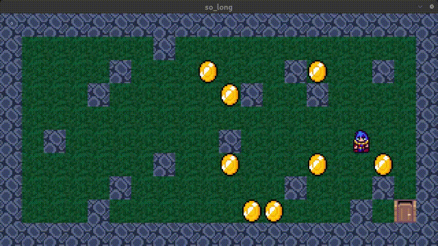

# So Long And Thanks For All The Fish! 🐬🎮

## Overview
This is a simple 2D game project created as part of a computer graphics course at 1337. The game allows players to control a character, collect items, and escape from a map while avoiding obstacles. The project is built using the MiniLibX graphical library and is written in C.

## Features
- Basic 2D gameplay mechanics 🌟
- Player movement using W, A, S, D keys (or arrow keys) ⬆️⬇️⬅️➡️
- Collectibles to gather 🍣
- A map with walls, free spaces, enemies, and an exit 🚪
- Smooth window management 🖥️
- Display of movement count in the shell 📊

## Game Animations
Here are some animations from the game:


## Getting Started
To run the game, you will need to compile the source code. Make sure you have the MiniLibX library installed.

### Prerequisites
- C compiler (gcc) 🛠️
- MiniLibX library

### Installing MiniLibX
You can install MiniLibX by following these steps:

1. Clone the MiniLibX repository:
   ```bash
   git clone https://github.com/42Paris/minilibx-linux.git
   cd minilibx-linux
   ```

2. Install the required packages (for Debian/Ubuntu):
   ```bash
   sudo apt-get install gcc make xorg libxext-dev libbsd-dev
   ```

3. Compile MiniLibX:
   ```bash
   ./configure
   make
   ```

4. Optionally, install the library:
   - You may want to install `libmlx.a` and/or `libmlx_$(HOSTTYPE).a` in `/usr/X11/lib` or `/usr/local/lib`
   - Install `mlx.h` in `/usr/X11/include` or `/usr/local/include`
   - Install `man/man3/mlx*.1` in `/usr/X11/man/man3` or `/usr/local/man/man3`

### Installation of the Game
1. Clone the game repository:
   ```bash
   git clone https://github.com/yourusername/so_long.git
   cd so_long
   ```

2. Compile the project using the provided Makefile:
   ```bash
   make
   ```
   or
   ```bash
   make bonus
   ```

4. Run the game with a map file:
   ```bash
   ./so_long path/to/map.ber
   ```

## Map Format
The game requires a map file in `.ber` format. The map must consist of:
- `1` for walls 🧱
- `0` for empty spaces 🌌
- `C` for collectibles 🍣
- `E` for the exit 🚪
- `P` for the player's starting position 🐬
- `X` for enemies (bonus part) 👾

### Example Map
```
111111
100001
1C0C01
1P0E01
1X1111
```

## Acknowledgments
A special shoutout to my friend [Ismail Najah](https://github.com/ismailnajah) for his invaluable help with the player sprite animations. Thank you for your support! 🙌
